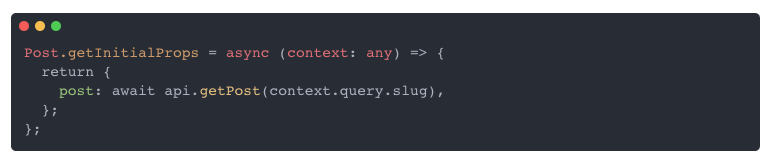
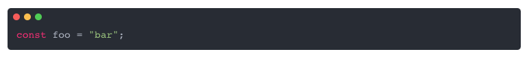

## @segersniels/window

[](https://github.com/segersniels/window/actions)[](https://www.npmjs.com/package/@segersniels/window)



## Demo

You can view it in action at my [blog](https://nielssegers.be).

## Usage

### react-markdown

Use it in combination with [react-markdown](https://github.com/rexxars/react-markdown) to nicely present code to the user.

```js
import Window from '@segersniels/window';
import ReactMarkdown from 'react-markdown';

...

<ReactMarkdown
  source={source}
  renderers={{
    code: Window,
  }}
/>

...
```

### Custom usage

Use it independently and pass whatever `children` you want to it. Please note that when passing `children` you will not have syntax highlighting enabled.

```js
<Window>
  <p>Hello World!</p>
</Window>
```

However you can pass your own code to the `value` prop directly and control the language by passing the `language` prop. This will override any children passed.

```js
<Window value='const foo = "bar";' language="javascript" />
```


